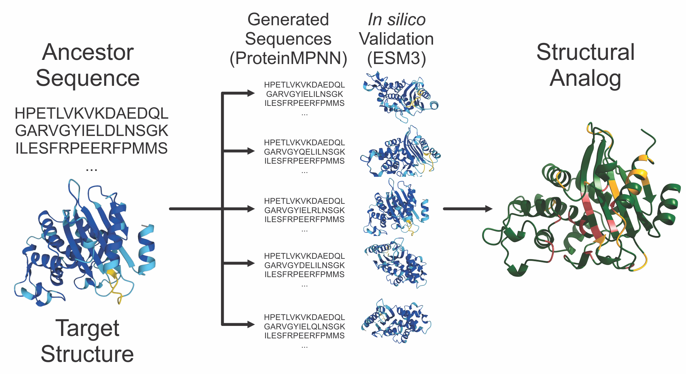
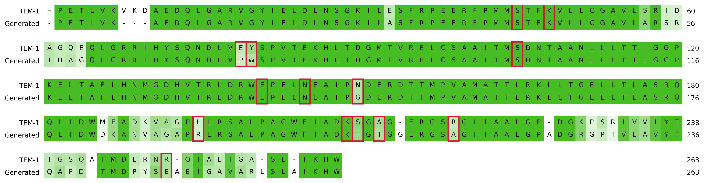
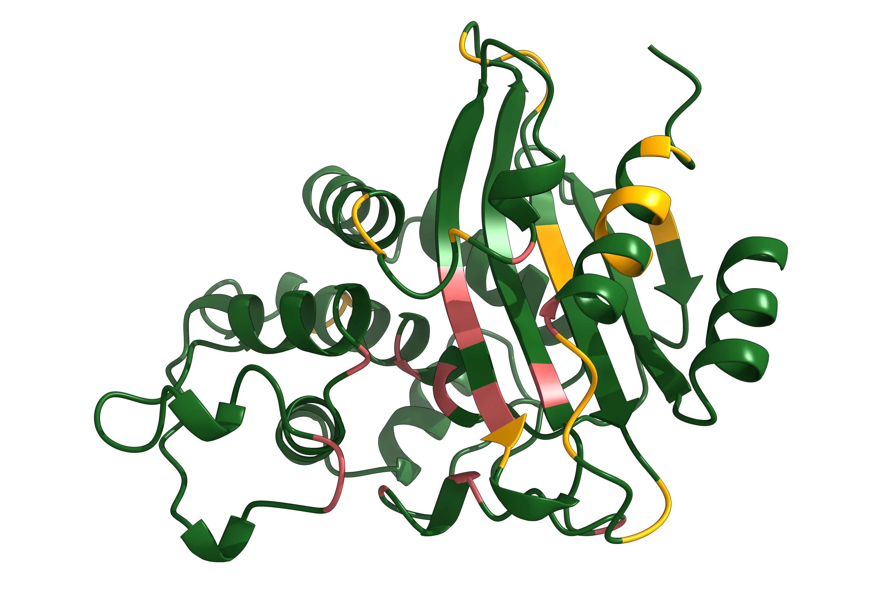
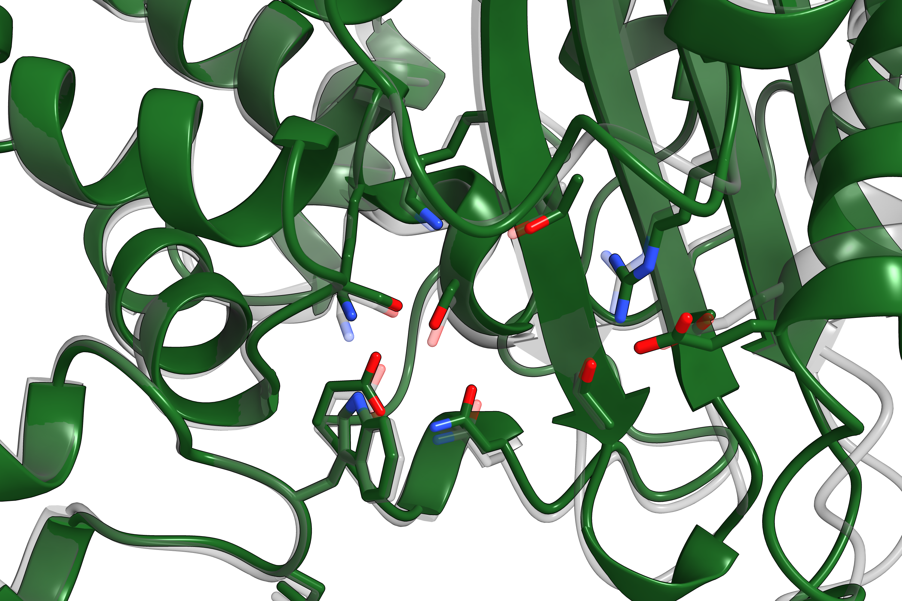

## 🔬 Biological Context & Findings: Mapping the Evolutionary Landscape

### 1. Rationale: Mapping Evolutionary Landscapes
Understanding how proteins evolve through different fitness landscapes is a central problem in molecular biology. As enzymes evolve novel catalytic functions, they must balance the acquisition of new active site geometries with the maintenance of global thermodynamic stability. Mapping these trajectories is particularly critical in the context of antibiotic resistance, where pathogens rapidly evolve enzymes capable of degrading synthetic therapeutics. 

I selected the Class A β-lactamases as a model system for this problem. These enzymes are highly clinically relevant, share a conserved overall tertiary fold, yet exhibit  functional divergence in their substrate profiles. By charting the structural and sequence requirements necessary to bridge distinct functional states within this superfamily, we can better anticipate resistance trajectories and identify structural constraints that may serve as novel therapeutic targets.

### 2. Structural Basis of Activity: TEM-1, CTX-M-15, and KPC-2
To explore this landscape, I focused on three canonical Class A β-lactamases that represent distinct evolutionary and phenotypic nodes:

* **TEM-1 (The Ancestral Penicillinase):** TEM-1 is a classical, narrow-spectrum β-lactamase. It efficiently hydrolyzes penicillins and early-generation cephalosporins but is largely inactive against bulky extended-spectrum cephalosporins and carbapenems. Its active site is relatively rigid and narrow, optimized for smaller β-lactam substrates.
* **CTX-M-15 (The Extended-Spectrum β-Lactamase - ESBL):** CTX-M-15 exhibits ~37% sequence identity to TEM-1 but has evolved to efficiently hydrolyze extended-spectrum cephalosporins like cefotaxime and ceftazidime. This extended spectrum is driven by structural deviations in the active site—specifically, mutations in the Ω-loop. These alterations increase the active site volume and flexibility, accommodating the bulky oxyimino side chains of newer cephalosporins.
* **KPC-2 (The Carbapenemase):** KPC-2 is an extreme generalist capable of hydrolyzing nearly all β-lactams, including the "last resort" carbapenems. Carbapenems typically act as inhibitors of Class A enzymes (like TEM-1) by forming a highly stable acyl-enzyme intermediate that resists deacylation. KPC-2 evades this "inhibitory trap" through a unique active site topology: a widened, more hydrophobic binding pocket, a recessed catalytic nucleophile, and a stabilizing disulfide bond. These features grant KPC-2 an exceptionally fast deacylation rate, allowing it to turn over carbapenems efficiently. Furthermore, KPC-2 possesses unusually high thermodynamic stability, which buffers the destabilizing effects of resistance-conferring mutations.

### 3. The Challenge of Minimal Mutations
Historically, researchers have attempted to map the evolutionary trajectory from narrow-spectrum enzymes like TEM-1 to carbapenemases like KPC-2 using directed evolution or minimal point mutations. These attempts consistently demonstrate that converting a TEM-1 scaffold into a functional KPC-2 equivalent via a minimal mutational walk is highly constrained. 

Introducing the critical catalytic residues of a carbapenemase directly into TEM-1 typically results in a loss of protein stability or an inactive enzyme. The functional divergence between these enzymes relies heavily on epistasis; the localized active site mutations required for carbapenem hydrolysis must be supported by a distributed network of compensatory backbone and second-shell mutations. Because TEM-1 and KPC-2 share only ~40% sequence identity, identifying the precise combination of remote compensatory mutations required to support the KPC-2 active site geometry within the TEM-1 backbone via standard directed evolution is prohibitively complex.

### 4. The Computational Grafting Approach
To bypass the limitations of stepwise random mutagenesis, I utilized a generative computational approach to construct "evolutionary bridges" directly. I employed ProteinMPNN to computationally graft the precise three-dimensional active site geometries of a target enzyme onto the structural scaffold of an ancestor. 

By fixing the spatial coordinates and identities of the active site residues and the binding pocket, then applying a configurable equilibrium bias toward the ancestral sequence, the pipeline recalculates the necessary second-shell and global compensatory mutations required to thermodynamically stabilize the new active site geometry. The resulting generated variants are *in silico* structural analogs: chimeric enzymes that possess the global backbone of the ancestor but the exact local catalytic geometry of the target.



### 5. Case Study: Evolving TEM-1 to KPC-2

To illustrate the pipeline's capability to explore the minimum evolutionary distance between structural nodes, we closely examined the conversion of the narrow-spectrum TEM-1 penicillinase into a structural analog of the KPC-2 carbapenemase. 

This represents a severe structural challenge. While both share the Class A α/β hydrolase fold, their catalytic apparatuses are distinct. TEM-1 possesses a narrow, relatively rigid binding cleft optimized for smaller β-lactams. In contrast, KPC-2 utilizes a widened, more hydrophobic binding pocket to accommodate bulky carbapenems. Furthermore, KPC-2 requires a uniquely positioned, highly dynamic Ω-loop to facilitate rapid deacylation, a topology that is physically incompatible with the native TEM-1 core without catastrophic loss of stability. 

Rather than attempting a stepwise mutational walk, our pipeline calculated the necessary global compensatory mutations required to drop the KPC-2 pocket directly into the TEM-1 scaffold. 

<p align="center">
  
</p>
<p align="center">
  <em><strong>Figure 1: Sequence Alignment.</strong> The generated structural analog retains the majority of the ancestral TEM-1 sequence (background), with specifically targeted deviations (highlighted) required to support the new active site geometry.</em>
</p>

By analyzing the output structures, we can map exactly how the model solved this epistatic puzzle. When viewing the global fold of the generated analog, it becomes clear that the required compensatory mutations are not randomly distributed surface variations. 

<p align="center">
  
</p>
<p align="center">
  <em><strong>Figure 2: Global Structural Analog.</strong> The constrained KPC-2 active site residues are locked in <strong>red</strong>. The compensatory mutations generated by the pipeline are highlighted in <strong>gold</strong>.</em>
</p>

Notably, the generated mutations (gold) heavily cluster within the hydrophobic core of the protein and at the base of the Ω-loop. To thermodynamically support the widened KPC-2 active site (red) without the stabilizing Cys69-Cys238 disulfide bridge native to true carbapenemases, the pipeline effectively repacked the ancestral core to buttress the new cavity. 

Finally, evaluating the local geometry confirms the success of the motif graft. 

<p align="center">
  
</p>
<p align="center">
  <em><strong>Figure 3: Active Site Superposition.</strong> A detailed zoom-in comparing the generated analog's binding pocket against the ground-truth KPC-2 target structure.</em>
</p>

Structural superposition of the generated active site against the native KPC-2 target demonstrates an excellent structural match. This confirms that the α/β hydrolase fold is sufficiently plastic to decouple global thermodynamic stability from local active site geometry, provided the core is properly repacked.

### 6. Analysis of Generative Trajectories
Below are the sequence identity matrices generated from 6 targeted computation grafting experiments:

```text
=======================================================
 EXPERIMENT: CTX-M-15 -> KPC-2
=======================================================
              | CTX-M-15      | KPC-2         | Generated
-------------------------------------------------------
CTX-M-15      | 100.0%        | 50.0%         | 91.3%
KPC-2         | 50.0%         | 100.0%        | 55.1%
Generated     | 91.3%         | 55.1%         | 100.0%
=======================================================

=======================================================
 EXPERIMENT: CTX-M-15 -> TEM-1
=======================================================
              | CTX-M-15      | TEM-1         | Generated
-------------------------------------------------------
CTX-M-15      | 100.0%        | 36.9%         | 77.7%
TEM-1         | 36.9%         | 100.0%        | 49.8%
Generated     | 77.7%         | 49.8%         | 100.0%
=======================================================

=======================================================
 EXPERIMENT: KPC-2 -> CTX-M-15
=======================================================
              | KPC-2         | CTX-M-15      | Generated
-------------------------------------------------------
KPC-2         | 100.0%        | 50.0%         | 92.0%
CTX-M-15      | 50.0%         | 100.0%        | 55.0%
Generated     | 92.0%         | 55.0%         | 100.0%
=======================================================

=======================================================
 EXPERIMENT: KPC-2 -> TEM-1
=======================================================
              | KPC-2         | TEM-1         | Generated
-------------------------------------------------------
KPC-2         | 100.0%        | 40.5%         | 81.2%
TEM-1         | 40.5%         | 100.0%        | 50.9%
Generated     | 81.2%         | 50.9%         | 100.0%
=======================================================

=======================================================
 EXPERIMENT: TEM-1 -> CTX-M-15
=======================================================
              | TEM-1         | CTX-M-15      | Generated
-------------------------------------------------------
TEM-1         | 100.0%        | 36.9%         | 77.2%
CTX-M-15      | 36.9%         | 100.0%        | 51.9%
Generated     | 77.2%         | 51.9%         | 100.0%
=======================================================

=======================================================
 EXPERIMENT: TEM-1 -> KPC-2
=======================================================
              | TEM-1         | KPC-2         | Generated
-------------------------------------------------------
TEM-1         | 100.0%        | 40.5%         | 80.1%
KPC-2         | 40.5%         | 100.0%        | 52.1%
Generated     | 80.1%         | 52.1%         | 100.0%
=======================================================
```

The pairwise sequence identity matrices reveal several distinct structural principles regarding the malleability of the Class A fold:

* **High Ancestral Retention:** Across all experiments, the generated chimeras successfully integrated the target active sites while maintaining a high degree of sequence identity to the starting scaffold (ranging from 77.2% to 92.0%). This demonstrates that wholesale sequence replacement is not necessary to jump between functional peaks; the global fold can support radically different active site geometries through a relatively small subset of targeted, epistatic backbone adjustments (accounting for 8–23% of the sequence).
* **Asymmetry in Evolutionary Directionality:** The data indicates an asymmetry when traversing the functional hierarchy. When grafting the simpler TEM-1 or CTX-M-15 active sites into the highly stable KPC-2 scaffold, the models retained 81.2% and 92.0% of the KPC-2 sequence, respectively. Conversely, when grafting the demanding KPC-2 or CTX-M-15 active sites into the ancestral TEM-1 scaffold, sequence retention dropped to 80.1% and 77.2%. This suggests that "upgrading" a narrow-spectrum, rigid scaffold (TEM-1) to accommodate the widened, dynamic pockets of ESBLs or carbapenemases requires more extensive global sequence deviation to provide the necessary structural compensation.

### 7. Conclusions and Implications
These findings yield three primary conclusions regarding evolutionary landscapes and protein structure:

1.  **Landscape Connectivity:** The fitness landscape of Class A β-lactamases is highly connected. The structural gap between a narrow-spectrum penicillinase and a broad-spectrum carbapenemase can be bridged by altering approximately 20% of the protein sequence, provided those mutations are strictly coordinated to resolve epistatic clashes.
2.  **Scaffold Plasticity:** The conserved α/β hydrolase fold of Class A enzymes acts as a highly plastic, modular scaffold. It is robust enough to decouple global thermodynamic stability from local active site geometry, allowing computation to "swap" entire catalytic apparatuses without destroying the protein.
3.  **Antibiotic Resistance:** From a clinical perspective, this plasticity underscores the persistent threat of resistance. If a relatively small number of compensatory mutations can stabilize the transfer of an ESBL or carbapenemase active site motif into diverse, previously susceptible enzymatic backgrounds, novel resistance phenotypes could emerge rapidly. This suggests that future antibiotic and inhibitor design must account for the dynamic structural malleability of these targets, rather than relying solely on the inhibition of static, strain-specific sequence features.

## 📦 Prerequisites & Installation

The pipeline requires **Python 3.9+** and the following packages:

```bash
pip install torch
pip install pandas
pip install numpy
pip install biopython
pip install tmtools
pip install esm
```

---

## ⚙️ Setup

**1. Clone the repository and the required submodules:**
Because this pipeline relies on the `ProteinMPNN` repository for sequence generation, you must clone it with the `--recurse-submodules` flag:

```bash
git clone --recurse-submodules [https://github.com/Nebraskinator/protein-gen.git](https://github.com/Nebraskinator/protein-gen.git)
cd protein-gen
```

---

## 🛠️ Configuration (`targets.json`)

Define your targets by providing the PDB path and the specific PDB residue tags that make up the active site you want to mimic. Create a `targets.json` file in your root directory:

```json
{
    "TEM-1": {
        "pdb": "data/TEM-1.pdb",
        "anchor": ["S70", "K73"],
        "motif": ["N104", "Y105", "S130"]
    },
    "CTX-M-15": {
        "pdb": "data/CTX-M-15.pdb",
        "anchor": ["S70", "K73"],
        "motif": ["N104", "Y105", "S130"]
    }
}
```

---

## 💻 Usage

Run the master pipeline across your entire configuration matrix:

```bash
python gen_search.py --config targets.json --seqs 128 --esm_model esm3-sm-open-v1
```

### Arguments:
* `--config`: Path to your JSON target matrix. (Required)
* `--seqs`: Number of ProteinMPNN candidate sequences to generate per bias step. (Default: `4`. I recommend `128+` for production runs).
* `--matrix_dir`: Output directory for folded PDBs and summaries. (Default: `./superfamily_matrix`).
* `--mpnn_dir`: Path to the local ProteinMPNN repository. (Default: `./ProteinMPNN`).
* `--esm_model`: The ESM3 model variant to use for folding. (Default: `esm3-sm-open-v1`).

---

## 📊 Evaluation & Outputs

The pipeline evaluates all ML models automatically and outputs a consolidated `evolution_matrix_results.csv` containing the optimal Equilibrium Bias and final Pocket RMSD for every pairwise experiment.

For granular debugging, check the `summary.txt` inside each specific run folder (e.g., `superfamily_matrix/TEM-1_to_CTX-M-15/summary.txt`) to view:
1. The complete sequence alignments.
2. The exact Equilibrium Bias required to achieve the fold.
3. The physical audit log verifying the identity of the grafted binding site on a per-residue basis.
